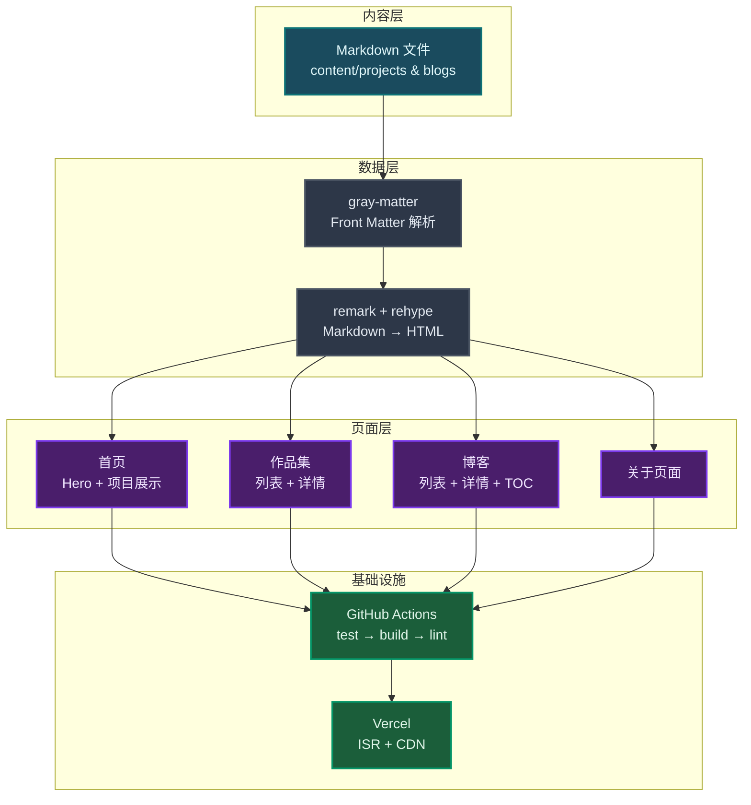
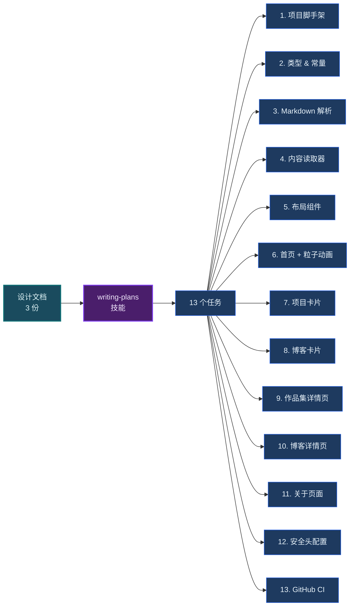
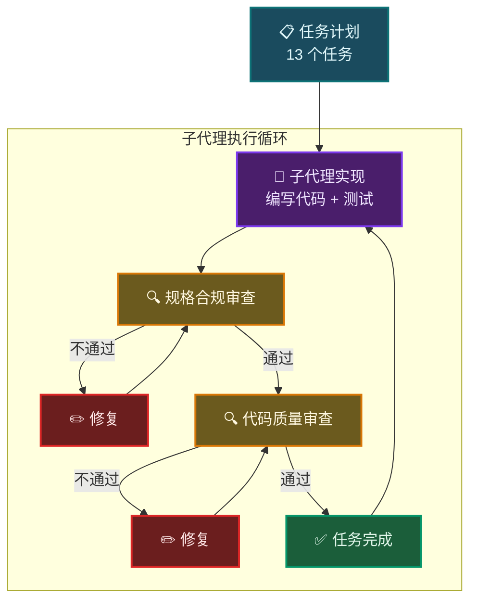
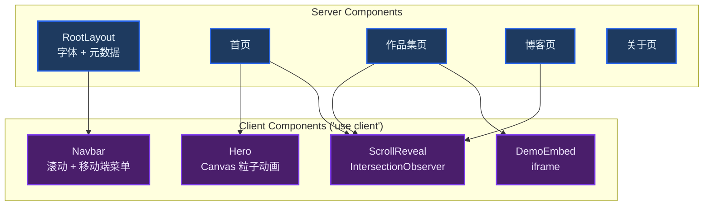
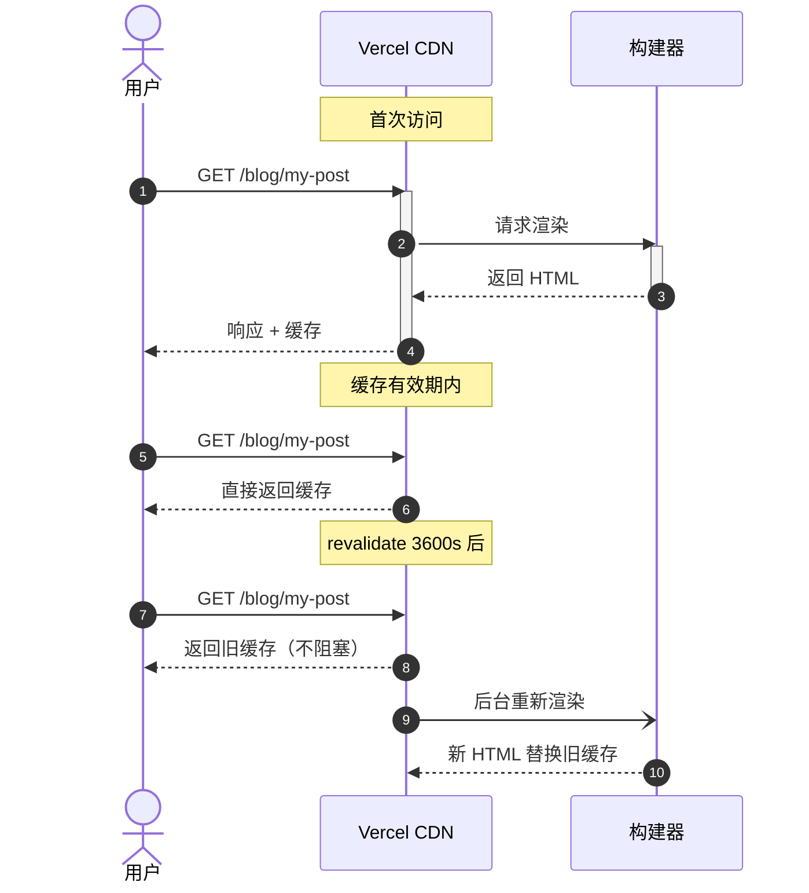
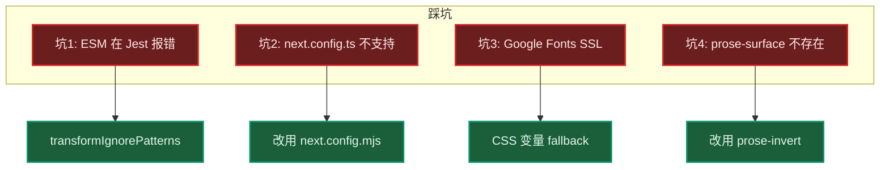
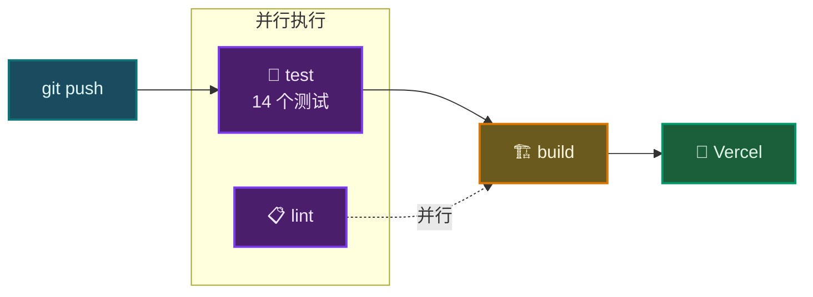
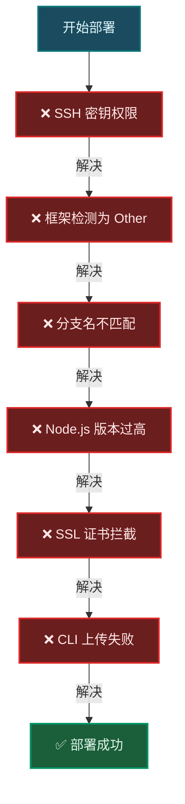

用 AI 写代码是最简单的部分。真正的战场在部署。

我用 Claude Code 从零构建了一个暗黑科技风的个人作品集网站——从空白目录到 Vercel 上线，14 个测试全通过，11 个页面成功生成。整个过程在一天内完成，但部署那一步，我踩了 6 个坑。

这篇文章记录了完整的开发流程、踩坑经过和解决方案。如果你也在尝试用 AI 工具构建项目，希望能帮到你。

## 技术选型

我选择了以下技术栈，兼顾开发效率和部署便利性：

| 技术 | 版本 | 用途 |
|------|------|------|
| Next.js | 14.2 | 全栈框架（App Router） |
| TypeScript | 5.x | 类型安全 |
| Tailwind CSS | 3.4 | 暗黑科技风主题 |
| Markdown + gray-matter | - | 内容管理 |
| Jest | 29.7 | 单元测试 |
| Vercel | - | 部署托管 |
| GitHub Actions | - | CI 流水线 |



## 第一步：先写设计文档，再让 AI 写代码

很多人拿到 AI 编程工具就直接让它写代码，这是最大的误区。**AI 最擅长的不是写代码，而是执行计划。计划的质量决定了输出的质量。**

在动手写代码之前，我准备了三份文档：

1. **架构文档（jiagou.md）** — 定义技术栈、目录结构、组件分层
2. **设计思维（thinkFile.md）** — 记录设计决策的理由和权衡
3. **详细设计规格（design spec）** — 包含配色方案、组件规格、交互细节

### 主题设计

我选择了暗黑科技风（Dark Sci-Fi）作为视觉方向：

- **主色**：`#6C63FF`（紫蓝渐变）
- **强调色**：`#00D9FF`（霓虹蓝）
- **背景**：`#0A0A0F` → `#1A1A2E`（深色层次）
- **字体**：Inter + JetBrains Mono

## 第二步：将设计文档转化为可执行计划

使用 Claude Code 的 **writing-plans** 技能，将设计文档拆解为 13 个可执行的任务。每个任务包含完整的测试代码、实现代码和提交命令。



## 第三步：代码实现——子代理驱动开发

我采用了一种 **Subagent-Driven Development（子代理驱动开发）** 模式：每个任务由独立的 AI 子代理实现，完成后再进行规格合规审查和代码质量审查。



### 关键实现决策

#### Server Components 为主

大部分页面不需要客户端 JavaScript，这意味着更小的包体积和更快的首屏加载：

```typescript
// Server Component：不打包到客户端
export default async function BlogPage() {
  const blogs = await getBlogs()
  return <PostList posts={blogs} />
}
```

仅在需要浏览器 API 时使用 `'use client'`：

| 客户端组件 | 原因 |
|-----------|------|
| Hero | Canvas 粒子动画 |
| Navbar | 滚动状态 + 移动端菜单 |
| ScrollReveal | IntersectionObserver |
| DemoEmbed | iframe 交互 |



#### ISR 增量静态再生

详情页每小时重新生成，兼顾性能和内容更新：

```typescript
export const revalidate = 3600 // 1 小时

export async function generateStaticParams() {
  const blogs = await getBlogs()
  return blogs.map(b => ({ slug: b.slug }))
}
```



#### Markdown 渲染管线


### 代码实现踩坑速查



**坑 1：ESM 模块在 Jest 中无法解析**

unified/remark/rehype 是 ESM 包，Jest 默认会忽略 node_modules。

```typescript
// jest.config.ts
transformIgnorePatterns: [
  '/node_modules/(?!(unified|remark|rehype)/)',
]
```

**坑 2：next.config.ts 不被支持**

Next.js 14.2.x 不支持 TypeScript 配置文件，必须使用 `.mjs` 后缀。

**坑 3：Google Fonts SSL 错误**

本地构建环境访问 Google Fonts 会遇到 `UNABLE_TO_GET_ISSUER_CERT_LOCALLY` 错误。通过 CSS 变量设置系统字体作为 fallback：

```css
--font-inter: "Inter", ui-sans-serif, system-ui, sans-serif;
--font-jetbrains-mono: "JetBrains Mono", ui-monospace, monospace;
```

**坑 4：Tailwind Typography 没有 prose-surface**

`prose-surface` 不是 Tailwind Typography 插件的内置类，使用 `prose-invert` 替代。

## 第四步：GitHub Actions CI

配置了三阶段 CI 流水线，每次推送自动运行：



关键配置：
- `concurrency` 控制避免重复构建
- `cancel-in-progress: true` 新推送自动取消旧的运行
- `permissions: contents: read` 最小权限原则

## 第五步：Vercel 部署——真正的战场

部署过程比预期复杂得多。我花在部署上的时间超过了写代码。



### 问题 1：SSH 密钥权限

本地 SSH 密钥关联在 `tianzhengyin0-pixel` 账户，无法推送到 `Tian-Zhen-Yin` 的仓库。

**解决**：为不同 GitHub 账户生成独立密钥，配置 SSH config：

```
Host github.com-tianzhenyin
  HostName github.com
  User git
  IdentityFile ~/.ssh/id_ed25519_tianzhenyin
  IdentitiesOnly yes
```

### 问题 2：Vercel 框架检测错误

项目创建时 `framework` 被设置为 `null`（Other），导致 Vercel 将项目当作静态站点处理，所有动态路由返回 404。

**解决**：通过 Vercel API 修正：

```bash
curl -X PATCH "https://api.vercel.com/v9/projects/{id}" \
  -d '{"framework":"nextjs","nodeVersion":"20.x"}'
```

### 问题 3：生产分支不匹配

Vercel 默认生产分支为 `main`，但仓库使用的是 `master`。

**解决**：将本地分支重命名为 `main` 并推送：

```bash
git branch -m master main
git push -u origin main
```

### 问题 4：Node.js 版本兼容

Vercel 默认使用 Node.js 24.x，但 Next.js 14.2 需要更低版本。通过 API 将 Node 版本设为 `20.x`。

### 问题 5 + 6：本地环境问题

本地网络 SSL 证书拦截导致 `vercel login` 失败，CLI 上传模式也无法工作。

最终方案：放弃 CLI 上传，改用 **Git 集成部署**——Vercel 直接从 GitHub 拉取代码构建。

### 最终部署方案


## 项目成果


- **14 个单元测试**全部通过
- **11 个页面**成功生成（含 SSG + ISR）
- **8 条路由**：首页、作品集列表/详情、博客列表/详情、关于页面
- **GitHub Actions CI** 自动化测试、构建、代码检查
- **Vercel 生产部署**成功上线

### 项目结构

```
ccFlow/
├── app/                    # Next.js App Router 页面
│   ├── page.tsx           # 首页
│   ├── layout.tsx         # 根布局
│   ├── projects/          # 作品集
│   ├── blog/              # 博客
│   └── about/             # 关于
├── components/            # React 组件
│   ├── home/              # 首页组件
│   ├── layout/            # 布局组件
│   ├── blog/              # 博客组件
│   ├── projects/          # 项目组件
│   └── ui/                # 通用 UI 组件
├── content/               # Markdown 内容
│   ├── projects/          # 项目描述
│   └── blogs/             # 博客文章
├── lib/                   # 工具函数
│   ├── types.ts           # 类型定义
│   ├── constants.ts       # 常量
│   ├── markdown.ts        # Markdown 解析
│   └── content.ts         # 内容读取
├── __tests__/             # 单元测试
└── .github/workflows/     # CI 配置
```

## 经验总结

### 关于 AI 辅助开发

> AI 最擅长的不是写代码，而是执行计划。计划的质量决定了输出的质量。

**三份设计文档是我做过的最有价值的投资。** 没有它们，AI 生成的代码会在架构层面反复返工。

### 关于部署

> 部署不是最后一公里——它是另一个完整的项目。

我花在部署上的时间超过了写代码。本地能跑不代表线上能跑。SSL、Node 版本、框架检测，每一个环节都可能出问题。

### 关于工作流

- **先规划再编码**：设计文档 → 计划 → TDD → 实现 → 审查，这个顺序不能乱
- **子代理分工**：实现、审查分离，避免自己审自己的盲区
- **Git 集成部署**：比 CLI 上传更可靠，也让 CI 流水线有意义

### 适合 AI 辅助的项目

- 有明确设计文档的项目
- 标准技术栈（Next.js、React、Tailwind 等）
- 内容驱动型网站（博客、作品集、文档站）
- 需要快速原型的 MVP

---

*本文由 PangHu 撰写，使用 Claude Code 辅助开发和部署。*

*项目源码：[github.com/Tian-Zhen-Yin/ccFlow](https://github.com/Tian-Zhen-Yin/ccFlow)*
